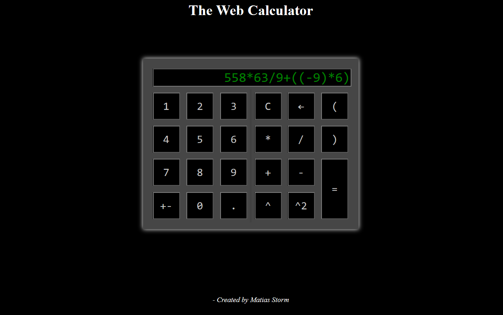

# Web Calculator
A calculator web app, where all changes to DOM-elements are made using JQuery and the logic of the calculator is written in JavaScript.
Hosted at: https://matiasstorm.github.io/WebCalculator/

## What i have learned:
- Manipulation DOM-elemets with JQuery
- Styling with CSS
- Building a website with HTML
- Object-oriented programming in JavaScript

# How to view the website using AMPPS:
- Clone the repository to the 'www' folder located in the Ampps folder.
- Run Ampps
- Go to localhost in your browser
- Open the cloned folder.
- The app should open, if it doesn't click the file called 'index.html'.

